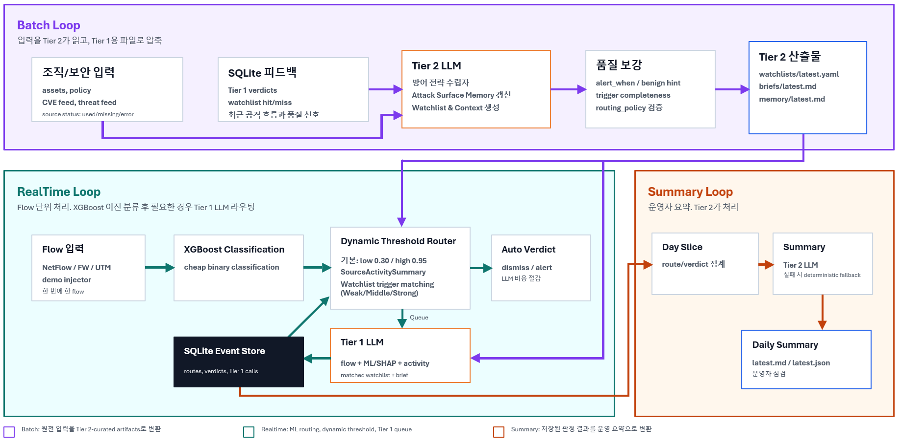

# Self LLM SOC

## 1. 프로젝트 개요

### 소개
Self LLM SOC는 소규모 조직을 위한 네트워크 보안 triage 시스템입니다.

기존 ML 탐지는 빠르지만, 조직의 자산 정보, 신규 CVE, 보안 정책, 위협 인텔 변화를 바로 반영하기 어렵습니다. 이 프로젝트는 XGBoost 기반 ML과 2단계 LLM 구조를 함께 사용해 네트워크 flow 중 보안 문맥을 반영해 위협을 능동적으로 판단하도록 설계했습니다.

### 핵심 목표
- 모든 flow를 LLM에 보내지 않고 ML로 먼저 빠르게 분류합니다.
- Tier 2 LLM이 자산, 정책, CVE, 위협 정보를 정리해 핵심 정보를 큐레이션합니다.
- Tier 1 LLM은 원본 자산/CVE/정책/threat feed를 직접 읽지 않고, Tier 2가 정리한 정보와 flow evidence만 보고 판단합니다.
- 결과는 SQLite event store, daily summary, dashboard에서 확인할 수 있습니다.

## 2. 시스템 설명

### 아키텍처


시스템은 크게 Batch Loop, Realtime Loop, Summary Loop로 구성됩니다.

- Batch Loop: Tier 2 LLM이 조직/보안 입력과 이전 피드백을 읽고 Tier 1이 사용할 Watchlist & Contexts, Attack Surface Memory, brief를 생성합니다.
- Realtime Loop: flow가 들어오면 XGBoost가 먼저 공격 여부에 대해 binary classification을 수행합니다. 이후 dynamic threshold router가 ML 점수, 최근 source activity, watchlist match를 함께 보고 임계치를 동적으로 조정하여 auto verdict 또는 Tier 1 LLM queue로 보냅니다. Tier 1 LLM은 Batch Loop에 의해 큐레이션된 정보와 각종 플로우 정보를 집계하여 조직 맥락에 맞게 공격 여부를 판단합니다.
- Summary Loop: SQLite에 저장된 판정 결과를 하루 단위로 모아 운영자용 daily summary를 생성합니다.

### 핵심 아이디어
이 구조의 핵심은 Tier 1 LLM과 Tier 2 LLM의 역할 분리입니다.

- 고지능 모델의 단점인 비용 및 지연 문제, 저지능 모델의 단점인 사고력 문제를 극복하기 위해 '고지능 모델이 사고하고, 저지능 모델이 고지능 모델의 사고를 기반으로 실시간 판단한다'의 아이디어를 적용했습니다.
- Tier 2는 조직/보안 원천 입력을 읽고 조직 맥락에 맞게 분석 및 정리하는 배치 분석가 역할을 하고, Tier 1은 실시간 flow 판단만 담당합니다. 따라서 Tier 1에는 원본 context dump가 들어가지 않습니다.
- 추가로 XGBoost 머신러닝 레이어의 라우팅 임계치 설정의 근본적 한계를 극복하기 위해 동적 임계치를 도입했습니다. Tier 2는 위험 자산/행동에 대해 기계적 매칭 증거를 생성하여 동적 임계치 설정을 가능하게 했습니다. 다만 머신러닝은 기계적 필터링 레이어이고 LLM 사고 레이어가 아니기 때문에 LLM에게 리뷰 대상을 넘겨주는 역할을 해야 합니다. 따라서 이 필터링 조건은 비교적 넓습니다.


## 3. AI 도구 활용 전략

- 아이디어를 구현으로 구체화: 지시사항을 구현으로 옮기기 전에 항상 LLM이 아이디어를 구체화하고 아이디어에 대한 잠재적 문제를 발견하여 보고하는 과정을 거치도록 지시했습니다. 이를 통해 세부 구현 사항이 의도대로 이루어지는지 사전에 확인하고 수정할 수 있습니다. 

```text
다음 작업으로, ML 레이어에 multiclass classification을 추가하여 category hint를 주도록 할 것임. 구현 명세서를 참고하여 다음 계획을 구체화하고, 누락된 부분이 있는지 확인:
데이터 전처리 (Attack Label을 가진 샘플만 필터링)
학습 스크립트 작성 및 실행
Realtime Loop의 컨텍스트 집계 레이어에 통합
Tier1 프롬프트에 반영
```

- LLM의 Project Context 및 Progress에 대한 파일 자동 갱신 및 자가 참조: AGENTS.md에 프로젝트 핵심 구조 및 진행 상황에 대해 자동 갱신하도록 하여 AI가 여러 대화 세션에서 흐름을 놓치지 않도록 지시했습니다.

```text
Documentation rule:
- Keep `Knowledge/PROJECT_STRUCTURE.md` updated whenever folders, files, or pipeline responsibilities change.
- That document must stay easy to understand and include an ASCII structure/flow diagram.
- If code behavior and documentation diverge, update the documentation in the same task.
```

- 적대적 리뷰 전략 (Gemini - Codex): Codex가 구현한 결과물에 대해 다른 AI 에이전트인 Gemini가 리뷰하도록 하여 잠재적 문제를 지적하고 수정하도록 했습니다.

```text
먼저 현재 최종 커밋으로부터 working directory의 변경사항을 확인할 것. Tier1 LLM call에 대한 큐 시스템이 구현된 것이 주요 변경사항으로 알고 있는데, 비동기 프로그래밍 관점에서 주요 구성 요소를 요약하고 문제점이 없는지 검토 바람.
```

## 4. 실행 방법(How to run)

### Windows 원클릭 제품 실행

먼저 Docker Desktop을 켠 뒤, 프로젝트 폴더에서 아래 파일을 더블클릭합니다.

```powershell
.\toggle_product_server.cmd
```

실행 후 브라우저에서 접속합니다.

```text
http://127.0.0.1:8080
```

실행 중인 cmd 창에서 아무 키나 누르면 제품 서버가 종료됩니다.

### Windows 원클릭 제품/데모 실행

제품 및 데모 컨트롤러를 함께 실행할 수 있습니다.
먼저 Docker Desktop을 켠 뒤, 프로젝트 폴더에서 아래 파일을 더블클릭합니다.

```powershell
.\toggle_demo_servers.cmd
```

실행 후 브라우저에서 접속합니다.

```text
제품: http://127.0.0.1:8080
데모 컨트롤러: http://127.0.0.1:8081
```

실행 중인 cmd 창에서 아무 키나 누르면 제품 서버 및 데모 컨트롤러가 종료됩니다.

### Docker 기반 제품 실행

원클릭 파일을 쓰지 않고 터미널에서 직접 실행하려면 다음 명령을 사용합니다.

```powershell
docker compose run --rm -p 8080:8080 app python scripts/product_api.py --config config/settings.example.yaml --host 0.0.0.0 --port 8080
```